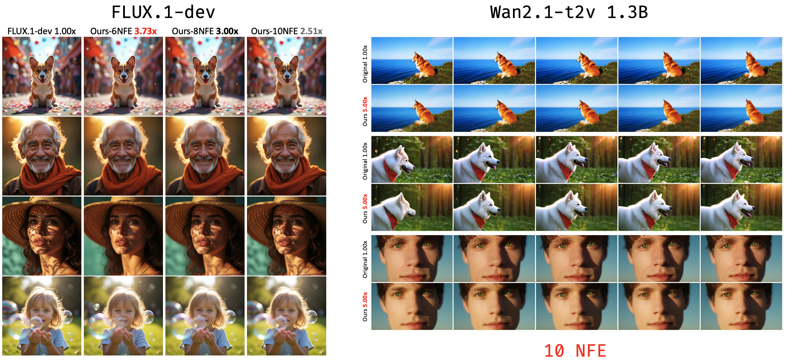

<div align="center">

# Budget-Constrained Step-Level Diffusion Caching

The paper and additional release materials will be released later this week.

Mingkun Lei<sup>1</sup>, Tong Zhao<sup>1,2</sup>, Liangyu Yuan<sup>1</sup>, Chi Zhang<sup>1</sup>

<sup>1</sup>AGI Lab, Westlake University, <sup>2</sup>Zhejiang University

Accepted by ICML 2026



</div>

## Overview

BudCache is a budget-constrained step-level caching method for accelerating diffusion generation. The goal is simple: given a fixed number of function evaluations (NFE), decide which denoising steps should run the model and which steps can reuse cached residuals, while preserving generation quality as much as possible.

This repository contains the reference implementation used for our paper. The current release supports two model families:

- FLUX
- Wan2.1

The method is organized as a two-stage pipeline.

## Method

### Stage 1: Cache-step search

Stage 1 searches for a cache schedule under a fixed NFE budget. For a diffusion sampler with `steps` total denoising steps and a target `nfe`, BudCache chooses `steps - nfe` steps to cache. The search objective compares the cached student trajectory against a full-compute teacher trajectory.

This is the main algorithmic component. Unless otherwise stated, the paper uses Stage 1 only.

### Stage 2: Optional schedule refinement

Stage 2 is optional. It keeps the Stage 1 cache-step selection fixed and learns a refined sampling schedule, with the goal of further improving generation quality. When the paper does not explicitly state that Stage 2 is used, the reported BudCache result uses Stage 1 only.

In short:

- Use Stage 1 for the standard BudCache result.
- Use Stage 2 when further schedule refinement is desired after a Stage 1 cache schedule has been found.

## Repository Layout

```text
configs/                 YAML configs for search, training, and evaluation
launchers/               Shell entrypoints using python -m / --module
scripts/                 Stage 1 search, Stage 2 training, and evaluation scripts
src/flux/                FLUX integration
src/wan/                 Wan2.1 integration
src/metric/              Image and video metric utilities
data/                    Small prompt files for smoke tests and examples
```

## Setup

Create an environment with the dependencies in `requirements.txt`. The exact CUDA, PyTorch, Diffusers, and Wan2.1 dependencies may need to match your local cluster environment.

```bash
pip install -r requirements.txt
```

BudCache expects model checkpoints to be available locally. Set either `MODEL_ROOT` or `MODEL_DIR` before running scripts:

```bash
export MODEL_ROOT=/path/to/pretrained_models
```

The model path used by scripts is:

```text
${MODEL_ROOT}/${model_name}
```

For example, with the default configs:

```text
${MODEL_ROOT}/FLUX.1-dev
${MODEL_ROOT}/wan2.1-t2v-1.3B
```

The default FLUX search script also expects the Hyper-SD LoRA at:

```text
${MODEL_ROOT}/lora_weights/Hyper-SD
```

## Data Format

Prompt files can be plain text, JSONL, or CSV:

- `.txt`: one prompt per line
- `.jsonl`: each line should contain a `prompt` field
- `.csv`: prompts are read from the `caption` column

Example prompt files are included under:

```text
data/train/
data/eval/
```

## Stage 1 Search

Stage 1 produces a checkpoint containing the selected cache steps. This checkpoint is the main artifact used by evaluation and optional Stage 2 training.

### FLUX

Edit `configs/search_flux.yaml` to set the resolution, total denoising steps, target `nfe`, and search budget.

Run:

```bash
bash launchers/search_flux.sh
```

The output is written under `outputs/search/`. The saved checkpoint contains a `cache_step` list.

### Wan2.1

Edit `configs/search_wan.yaml` to set the Wan task, resolution, frame count, total steps, target `nfe`, and search budget.

Run:

```bash
bash launchers/search_wan.sh
```

The output is written under `outputs/search/`.

## Stage 2 Optional Training

Stage 2 learns a refined sampling schedule after Stage 1 has selected the cache steps. This stage is optional; by default, BudCache uses the Stage 1 cache schedule directly.

### FLUX

Set `stage1_cacheStep` in `configs/train_flux.yaml` to a Stage 1 checkpoint:

```yaml
stage1_cacheStep: "outputs/search/<stage1-run>/<checkpoint>.pt"
```

Run:

```bash
bash launchers/train_flux.sh
```

### Wan2.1

Set `cache_step_path` in `configs/train_wan.yaml` to a Stage 1 checkpoint:

```yaml
cache_step_path: "outputs/search/<stage1-run>/<checkpoint>.pt"
```

Run:

```bash
bash launchers/train_wan.sh
```

## Evaluation

### FLUX

Run FLUX evaluation with a Stage 1 checkpoint:

```bash
STAGE1_CKPT=outputs/search/<stage1-run>/<checkpoint>.pt \
GPUS_PER_NODE=2 \
bash launchers/sample_flux.sh
```

### Wan2.1

Run Wan2.1 evaluation with a Stage 1 checkpoint:

```bash
STAGE1_CKPT=outputs/search/<stage1-run>/<checkpoint>.pt \
GPUS_PER_NODE=1 \
bash launchers/sample_wan.sh
```

If you trained an optional Stage 2 schedule, pass it as:

```bash
STAGE1_CKPT=outputs/search/<stage1-run>/<checkpoint>.pt \
STAGE2_CKPT=outputs/train/<stage2-run>/ckpt/final.pt \
GPUS_PER_NODE=1 \
bash launchers/sample_wan.sh
```

Leave `STAGE2_CKPT` empty for the Stage 1-only setting.

## Metrics

Image quality metrics for FLUX:

```bash
EVAL_RUN_DIR=outputs/eval/<run-dir> \
PROMPTS_FILE=data/eval/drawbench.txt \
bash launchers/metric_flux.sh
```

Video reconstruction metrics for Wan2.1:

```bash
EVAL_RUN_DIR=outputs/eval/<run-dir> \
bash launchers/metric_wan.sh
```

## Configuration Notes

Important search fields:

- `steps`: total denoising steps.
- `nfe`: number of model evaluations to keep.
- `stage0_multiStart`: number of random restarts.
- `stage1_sa_iters`: simulated annealing iterations.
- `stage2_hc_iters`: hill-climbing refinement iterations.

Important evaluation fields:

- `dataset_path`: prompt file.
- `samples_per_prompt`: number of generated samples per prompt.
- `height` and `width` for FLUX.
- `size` and `frame_num` for Wan2.1.

## Citation

If you use this code, please cite:

```bibtex
```

## Acknowledgements

We thank the [FLUX.1-dev](https://github.com/black-forest-labs/flux) and [Wan2.1](https://github.com/Wan-Video/Wan2.1) teams and communities for making their models and tooling available. We are also grateful to the authors of prior work on diffusion caching and acceleration; this project builds on insights and resources from the broader research and open-source communities.

## Limitations

BudCache is intended as a reference implementation and a reproducible starting point rather than a final answer to diffusion caching. We explored scalable ways to search for strong cache schedules in both Stage 1 and the optional Stage 2, but the current release does not fully explain why particular cache patterns succeed or transfer across settings. The relationship between instance-specific and global cache schedules also remains an open question. The reported Stage 1 and Stage 2 results were obtained within the compute budgets available to us, and should not be interpreted as absolute performance limits. We may add more technical notes and development history in future updates.